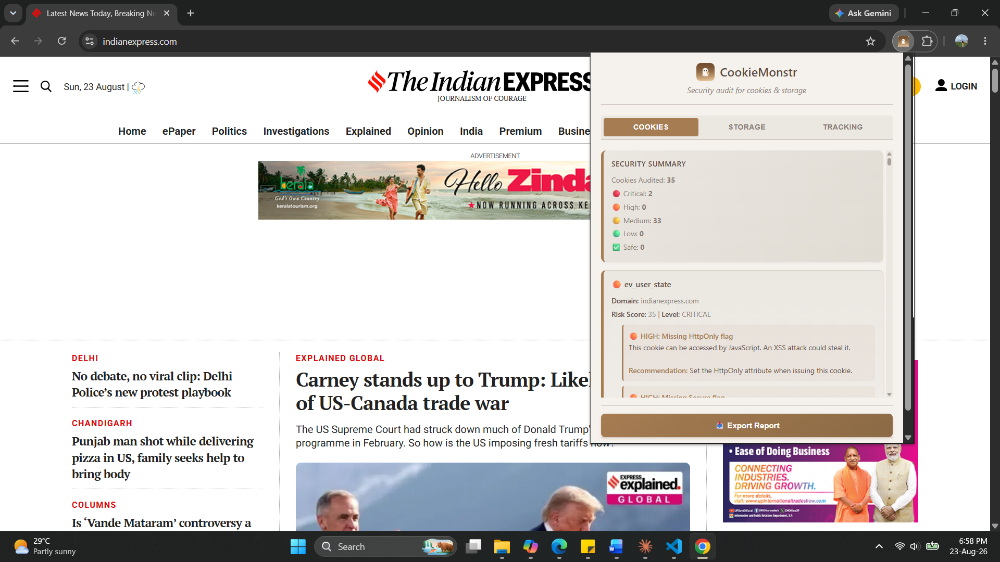
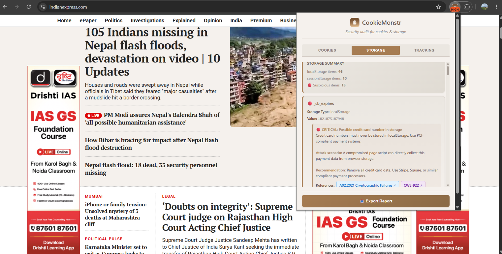
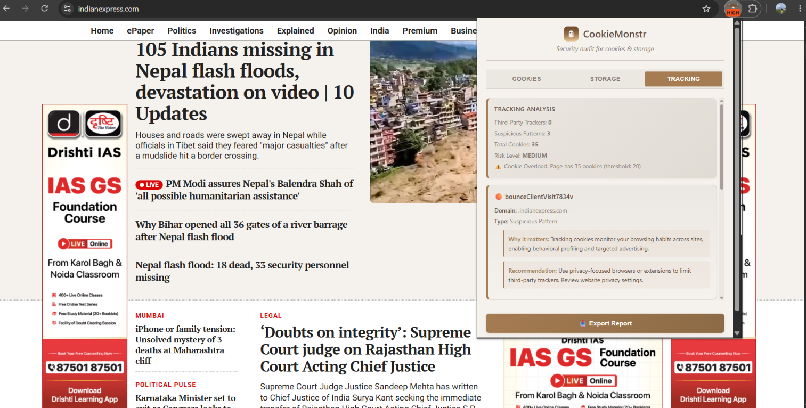
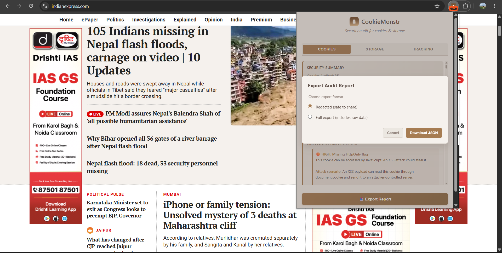
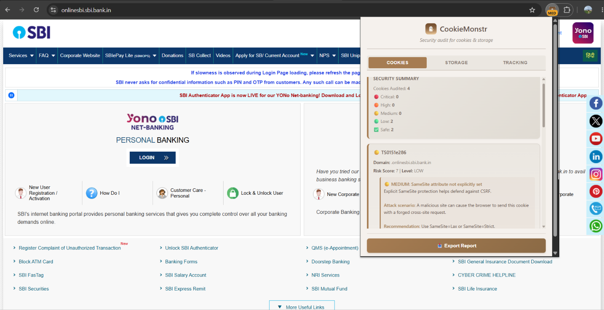
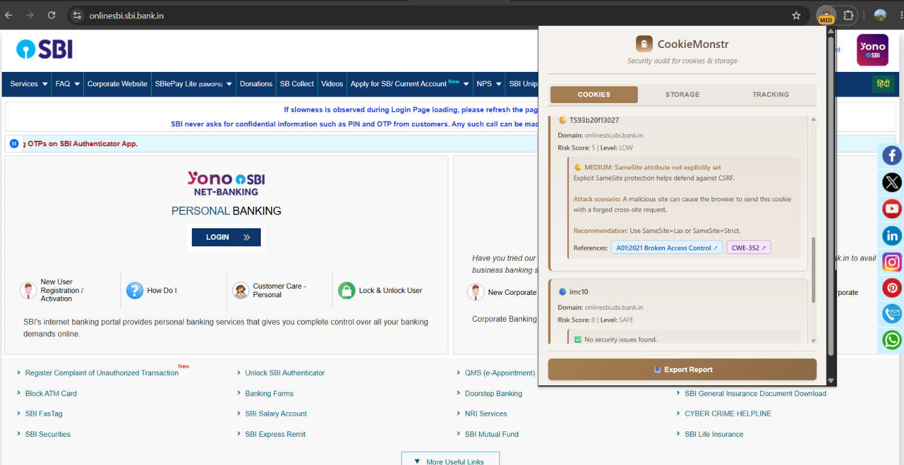
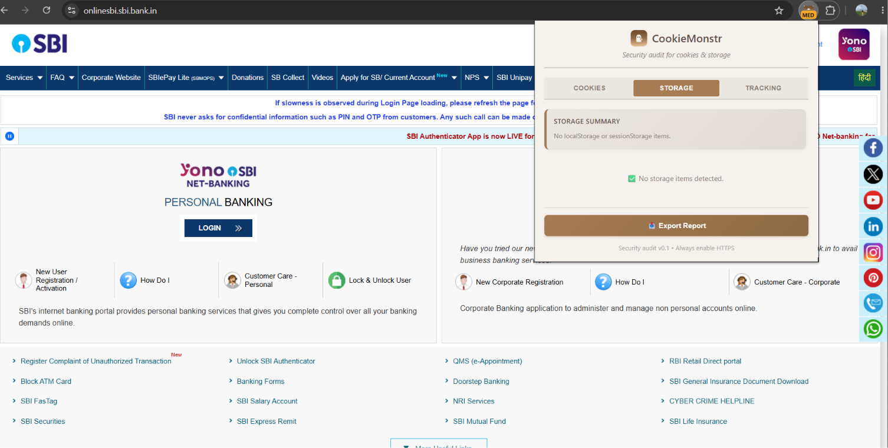
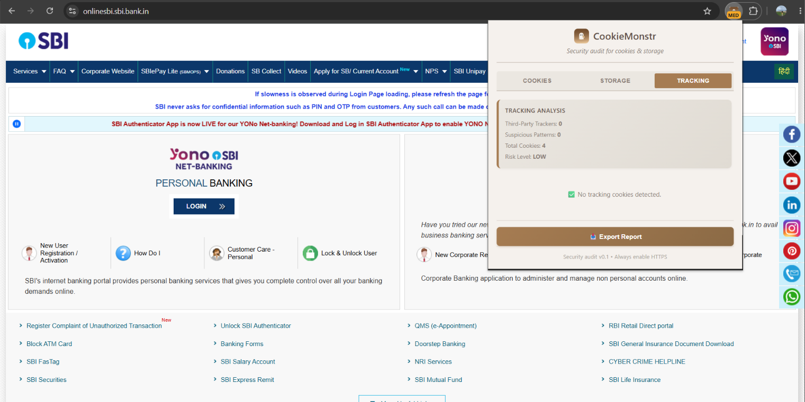

# CookieMonstr

**Local-first browser security research tool for cookies, web storage, and tracking signals.**

CookieMonstr is a Manifest V3 Chrome extension for inspecting the client-side security posture of a webpage. It audits cookie attributes, identifies sensitive values in `localStorage` and `sessionStorage`, detects tracking-related cookie signals, and produces JSON reports enriched with OWASP Top 10 and CWE references.

The project is intended for security research, defensive testing, education, and responsible disclosure workflows. It does not exploit findings, modify browser state, or transmit audit data to a remote service.

## Research Focus

CookieMonstr helps answer practical questions during a client-side security review:

- Are authentication and session cookies protected with `HttpOnly`, `Secure`, and `SameSite` attributes?
- Is sensitive information being persisted in JavaScript-readable web storage?
- Are third-party or tracking-oriented cookie patterns present?
- Which OWASP Top 10 categories and CWE classes are associated with the findings?
- Can an audit be shared safely without exposing raw storage values?

It is a visibility and triage tool, not a replacement for application testing, source review, network inspection, or a full DAST/SAST platform.

---

## Real-world findings

Testing on real sites demonstrates both the sensitivity and the calibration of the tool — it surfaces genuine vulnerabilities on high-risk sites, and correctly returns a clean result on a well-secured one.

---

### The Indian Express (indianexpress.com) — High-risk news site

<p float="left">
  
  
  
  
</p>


| Metric | Result |
|---|---|
| Cookies audited | 35 |
| Critical | 2 |
| Medium | 33 |
| localStorage items | 46 |
| sessionStorage items | 10 |
| Suspicious storage items | 15 |
| Third-party trackers | 0 |
| Suspicious tracking patterns | 3 |
| Toolbar badge | 🟠 HIGH |

**Cookie findings:** Two cookies were scored Critical. The `ev_user_state` cookie (Risk Score: 35) was missing both the HttpOnly and Secure flags — without HttpOnly, any JavaScript on the page can read the cookie via `document.cookie`, making it vulnerable to session theft via XSS. Without Secure, it transmits over unencrypted HTTP connections. Both are flagged separately as HIGH severity findings.

**Storage findings — the most significant result:** The `_cb_expires` key in localStorage was flagged Critical for containing a possible credit card number (`1821875187948` — a 13-digit value matching card number patterns). This maps to **A02:2021 Cryptographic Failures** and **CWE-922 (Insecure Storage of Sensitive Information)**. The attack scenario shown by the extension: a compromised page script can directly collect this payment data from browser storage. Credit card data must never be stored in localStorage — PCI-DSS compliance requires server-side handling via compliant payment processors such as Stripe or Square. Across 46 localStorage items and 10 sessionStorage items, 15 were flagged as suspicious.

**Tracking findings:** No third-party trackers were detected from the known blocklist, but 3 suspicious patterns were identified. The `bounceClientVisit7834v` cookie was flagged for a naming pattern consistent with behavioural profiling and session tracking. The page also triggered a cookie overload warning — 35 cookies exceeds the threshold of 20, which indicates either poor cookie hygiene or extensive analytics instrumentation.

**Export:** The Redacted export mode (default) strips raw storage values before writing to file, so this report can be shared publicly without exposing the flagged credit card value or session identifiers.

---

### SBI Net Banking (onlinesbi.sbi.bank.in) — Well-secured banking site

<p float="left">
  
  
  
  
</p>

| Metric | Result |
|---|---|
| Cookies audited | 4 |
| Critical | 0 |
| High | 0 |
| Medium | 0 |
| Low | 2 |
| Safe | 2 |
| localStorage items | 0 |
| sessionStorage items | 0 |
| Third-party trackers | 0 |
| Suspicious tracking patterns | 0 |
| Toolbar badge | 🟡 MED |

**This is what a well-secured site looks like.** SBI's net banking portal uses only 4 cookies, no client-side storage, and zero third-party trackers — a minimal, disciplined configuration that is exactly appropriate for a financial institution. Two cookies (`imc10`, and one other) scored Risk Score 0 with the SAFE designation and "No security issues found."

**The one real finding:** Two session cookies — `TS0151e286` (Risk Score: 7) and `TS93b20f13027` (Risk Score: 5) — were missing an explicit SameSite attribute. The extension surfaces this as a MEDIUM finding mapped to **A01:2021 Broken Access Control** and **CWE-352 (Cross-Site Request Forgery)**. The attack scenario: a malicious site can craft a forged request to SBI's domain, and without SameSite, the browser will automatically include these cookies in that request — the basis of a CSRF attack. The recommendation is explicit `SameSite=Lax` or `SameSite=Strict` on both cookies.

This finding is not a critical vulnerability in isolation — modern browsers default to Lax behaviour for cookies without an explicit SameSite attribute — but explicit declaration is an OWASP-recommended hardening measure, and it is correct for a security tool to surface it. The fact that this is the *only* finding on India's largest public-sector banking portal validates that CookieMonstr does not manufacture noise on clean sites. The `MED` toolbar badge reflects the aggregate of the SameSite gaps; there are no Critical or High findings anywhere on the page.

**The contrast between these two sites** is the clearest demonstration of what CookieMonstr is for: a major news site with 35 cookies, 15 suspicious storage items, and a possible credit card number in localStorage versus a banking portal with 4 cookies, no storage, no trackers, and one low-severity configuration gap. The tool calibrates correctly to both.


## Capabilities

### Cookie Security Audit

The background service worker retrieves cookies for the active page through the Chrome Cookies API. Each cookie is evaluated against seven rules:

| Finding | Severity | Reference |
| --- | --- | --- |
| Missing `HttpOnly` | High | CWE-1004 |
| Missing `Secure` on likely session cookies | High | CWE-614 |
| Missing explicit `SameSite` | Medium | CWE-352 |
| `SameSite=None` without `Secure` | High | CWE-352 |
| Sensitive cookie without `Secure` | High | CWE-614 |
| Broad domain scope | Low | CWE-732 |
| Long-lived authentication cookie | Medium | CWE-613 |

Cookie risk scores use the current weights below:

- High: 10 points
- Medium: 5 points
- Low: 2 points
- Informational: 0 points

Risk levels are `SAFE`, `LOW`, `MEDIUM`, `HIGH`, and `CRITICAL`.

### Web Storage Analysis

The content script reads page-local `localStorage` and `sessionStorage` and passes the values to the storage audit logic. Detection covers:

- API keys and secrets
- JWT, OAuth, bearer, and other authentication tokens
- Passwords and session identifiers
- Email addresses
- Credit card numbers and SSNs
- PEM private keys

Values displayed in the popup are truncated. Access may be unavailable on restricted browser pages or pages where the content script cannot run.

### Tracking Signals

The Tracking tab identifies known tracker domains and suspicious cookie naming patterns. It also reports cookie overload when a page has more than 20 cookies and assigns a tracking risk level based on detected signals.

This is heuristic detection. A tracker match does not prove malicious behavior, and the absence of a match does not prove that a page is free of tracking.

### Toolbar Severity Badge

After a page finishes loading, the extension silently audits its cookies and updates the toolbar badge with the highest finding severity:

| State | Badge | Color |
| --- | --- | --- |
| Critical finding | `CRIT` | Red |
| High finding | `HIGH` | Orange |
| Medium finding | `MED` | Amber |
| Low or informational finding | `LOW` | Green |
| No findings | `✓` | Grey |

Opening the popup also refreshes the badge for the active tab in case the service worker was idle during navigation.

### JSON Reporting

The export dialog provides two modes:

- **Redacted export**: the default. Redacts values associated with sensitive key names, IP addresses, email addresses, nested sensitive JSON keys, and high-entropy strings likely to be tokens or encoded identifiers.
- **Full export**: explicitly selected by the user and includes the raw storage dump.

Redaction is applied to a copy of the audit data at export time. It does not change the in-memory audit state. Reports include cookie findings, storage findings, tracking signals, timestamps, page URL, and OWASP coverage counts. Mapped findings also include CWE and OWASP metadata with attack scenarios.

## OWASP and CWE Mapping

Mapped findings currently cover these OWASP Top 10 categories:

- **A01:2021 - Broken Access Control**: SameSite and CSRF-related cookie exposure
- **A02:2021 - Cryptographic Failures**: Sensitive information and credentials in browser storage
- **A05:2021 - Security Misconfiguration**: Cookie configuration and domain-scope issues
- **A07:2021 - Identification and Authentication Failures**: Session and authentication cookie/token issues

Each mapped finding can include an OWASP category, CWE identifier, MITRE reference URL, and a concise attack scenario. These mappings describe vulnerability classes; they are not CVE identifiers and do not assert that a specific software vulnerability exists.

## Installation

CookieMonstr is currently installed from source as an unpacked extension.

1. Clone or download this repository.
2. Open `chrome://extensions/` in Chrome.
3. Enable **Developer mode**.
4. Select **Load unpacked**.
5. Choose the project directory.
6. Pin CookieMonstr to the toolbar for badge visibility.

After code changes, use **Reload** on the extension card. Reload the target webpage when testing content-script behavior.

## Usage

1. Navigate to a permitted webpage.
2. Wait for the page to finish loading so the toolbar badge can update.
3. Open CookieMonstr from the toolbar.
4. Review the **Cookies**, **Storage**, and **Tracking** tabs.
5. Select **Export Report** to choose a redacted or full JSON report.
6. Use the OWASP and CWE reference badges to open authoritative documentation in a new tab.

Do not test systems without authorization. When using findings for disclosure, minimize collected data and prefer the redacted export unless raw values are strictly required for private analysis.

## Architecture

```text
Active webpage
    |
    | content_scripts/storage_reader.js
    v
Popup ----------------------------+
    |                             |
    | GET_COOKIES                 | GET_STORAGE
    v                             v
Service worker              Storage audit
    |                             |
    v                             v
Cookie audit + rules        Enriched findings
    |                             |
    +-------------+---------------+
                  v
       Popup rendering and export
                  |
                  v
        Redacted/full JSON report
```

## Repository Structure

```text
CookieMonstr/
├── manifest.json
├── README.md
├── assets/icons/
├── background/
│   └── service_worker.js       # Cookie retrieval, audit requests, toolbar badge
├── content_scripts/
│   └── storage_reader.js       # Page-local storage reader
├── lib/
│   ├── cookieAudit.js          # Cookie evaluation and severity ranking
│   ├── cookieRules.js          # Cookie security rules
│   ├── export.js               # JSON report construction and redaction
│   ├── mappings.js              # OWASP/CWE finding metadata
│   ├── riskScore.js             # Risk scoring and summary generation
│   ├── storageAudit.js          # Sensitive storage pattern detection
│   └── trackingDetector.js      # Tracking detection utilities
└── popup/
    ├── popup.html              # Popup structure
    ├── popup.css               # Popup presentation
    └── popup.js                 # Audit rendering and user interactions
```

## Permissions and Privacy

| Permission | Purpose |
| --- | --- |
| `cookies` | Read cookies associated with the active URL for analysis |
| `activeTab` | Identify the current page and support popup actions |
| `scripting` | Support page interaction required by the extension |
| `<all_urls>` | Allow audits across supported websites |

CookieMonstr is local-first:

- Audit processing runs in the browser.
- No audit data is uploaded to a CookieMonstr server.
- Cookies and storage are read but not modified.
- The extension does not create user accounts or collect browsing history.
- Chrome system and extension pages are excluded from auditing.

Because the extension can inspect sensitive browser data, use it only on systems and websites where you have permission. Treat full exports as sensitive artifacts and store them securely.

## Limitations and Interpretation

- Cookie findings are based on attributes exposed by the Chrome Cookies API and heuristic identification of likely session cookies.
- The storage reader can access only page contexts where the content script is allowed to run.
- Tracking detection is domain and naming based; it is not a complete network-level tracker inventory.
- A finding is a signal for investigation, not proof of exploitability or business impact.
- The extension does not inspect server-side session invalidation, application authorization logic, TLS configuration, or response bodies.
- The current project has no automated test suite in `tests/`; manual validation in Chrome remains important.

## Development

The project uses:

- Manifest V3
- Vanilla JavaScript with ES modules
- Chrome extension APIs
- CSS3

There are no runtime package dependencies or build steps. Edit the source files directly, reload the unpacked extension in Chrome, and inspect the extension service worker console for background errors.

Before submitting changes, check:

```bash
git diff --check
```

Then manually verify cookie findings, storage detection, badge states, external reference links, and both export modes on authorized test pages.

## Roadmap

Potential future work includes:

- Automated unit tests for cookie rules, redaction, mappings, and risk scoring
- Historical audit comparison and trend reporting
- Network-aware tracker discovery
- Compliance-oriented report formats
- Configurable detection rules and severity thresholds
- Additional browser support

## References

- [Chrome Extensions documentation](https://developer.chrome.com/docs/extensions/)
- [Chrome Cookies API](https://developer.chrome.com/docs/extensions/reference/api/cookies)
- [OWASP Top 10](https://owasp.org/www-project-top-ten/)
- [OWASP Session Management Cheat Sheet](https://cheatsheetseries.owasp.org/cheatsheets/Session_Management_Cheat_Sheet.html)
- [OWASP Cookie Security](https://owasp.org/www-community/controls/Cookie_Security)
- [MITRE CWE](https://cwe.mitre.org/)
- [MDN Web Storage API](https://developer.mozilla.org/en-US/docs/Web/API/Web_Storage_API)

## Author

**Urvija Kapila**
B.Tech CSE (Cyber Security), Dayananda Sagar University

---

*Built as part of an independent security research portfolio. All findings on third-party sites are documented for educational purposes only.*
